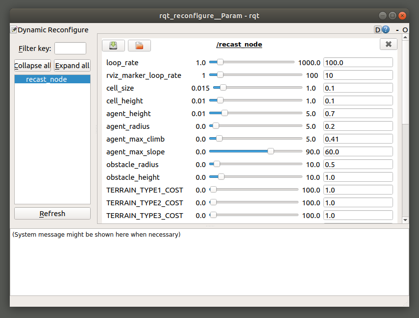
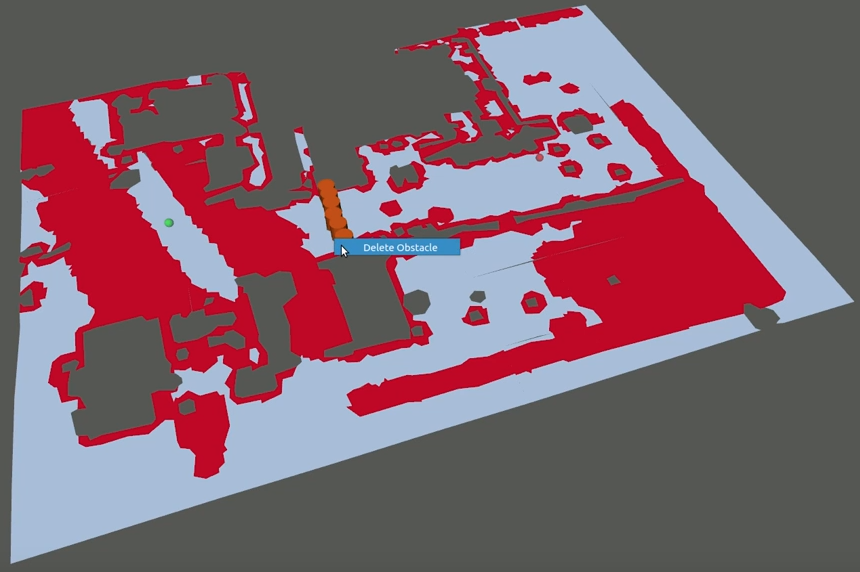

# recast_ros 

This package is a ROS wrapper for [recastnavigation](https://github.com/recastnavigation/recastnavigation.git). It allows to build and use navigation meshes for path planning, where the meshes can have areas of different types (and costs).


If you use this in your research, please cite:

> Martim Brandao, Omer Burak Aladag, and Ioannis Havoutis, "**GaitMesh: controller-aware navigation meshes for long-range legged locomotion planning in multi-layered environments**", in *IEEE Robotics and Automation Letters (RAL)*, 2020.

The paper is available [here](https://www.martimbrandao.com/papers/Brandao2020-ral.pdf), and the associated video is [here](https://www.youtube.com/watch?v=_BlhgTmFCOo).

## Features

- Building navigation meshes
- Fast path planning in navigation meshes (<1ms)
- Projecting points to a navigation mesh
- Adding / removing virtual static obstacles
- Filtering inaccessible triangles given a reference point
- Visualizing the graph representation of the navigation mesh
- Dynamic reconfiguration through dynamic_reconfirgure and ros parameters

## Building

You need to clone the original recastnavigation source code:
```
git clone https://github.com/ori-drs/recastnavigation
```

## Usage

### Get an annotated triangular mesh

If you want to use our pipeline for legged robot locomotion, you should clone, compile and follow the instructions in the [gaitmesh](https://github.com/ori-drs/gaitmesh) repository to get an annotated triangular mesh.

### Input mesh service to recast_node:

First get a triangular mesh, either through gaitmesh (as above) or your own method.
In the latter case, set the "path" and "path_areas" parameters in recast_demos/launch/test_input_map.launch accordingly:

- "reference_point_x", "reference_point_y", "reference_point_z" defines reference point to build filtered NavMesh.
- "path" is the path to an .obj file with the mesh of your environment.
- "path_areas" (optional) is the path to a .dat file which is a binary-encoded sequence of char variables representing the area-type of each of the polygons in the .obj file, in the same order.

Then:

```
roslaunch recast_demos recast_node.launch
roslaunch recast_demos test_input_map.launch
```

### Reconfiguration of RecastPlanner

For the configuration of NavigationMesh and other parameters regarding to planner you can run:

```
rosrun rqt_reconfigure rqt_reconfigure
```

and set parameters to desired values.



Dynamic reconfiguring can also be turned off in the recast_node.launch file, in case you prefer to use launch-file parameters instead.

In this case you can run:

```
rosparam set /recast_node/param_name param_value
rosrun recast_ros test_update_parameters
```

This will update both configuration parameters and ros parameters. Mesh will be updated, if one of the mesh parameters is changed.

### Interactive RViz GUI:

This package comes with interactive user interface node (recast_node_interactive). 

You can use RViz InteractiveMarkers to,

- Set start position for the agent
- Set goal position for the agent
- Add obstacle(s) to desired position
- Remove all existing obstacles
- Delete specific obstacle(s)




All the changes made through recast_node_interactive will appear in recast_node RViz window.

#### WARNING:

While using the package, do not visualize InteractiveMarkers with Markers::LINE_LIST or Markers::LINE_STRIP, if you have an NVIDIA graphic card.
It causes RViz to segfault and crash.

Refer [here](https://github.com/ros-visualization/rviz/issues/1192) for details.

### Testing path planning service:

After input map is given to recast_node, for planning run:

```
rosrun recast_ros test_planning_service [start x] [start y] [start z] [goal x] [goal y] [goal z]
```

Other option is,

```
rosrun recast_ros test_planning_service_interactive
```

Use '2D Nav Goal' tool in RViz to give goal position to the agent. Start position is defined in recast_ros/src/nodes/test_planning_service_interactive.cpp


### Adding static obstacles service:

All obstacles assumed to be in cylindrical shape, to add obstacles to map run:

```
rosrun recast_ros test_add_obstacles [x pos] [y pos] [z pos] [radius] [height]
```

Each re-build operations removes all the obstacles present, another way to remove all obstacles is,

```
rosrun recast_ros test_remove_all_obstacles
```
